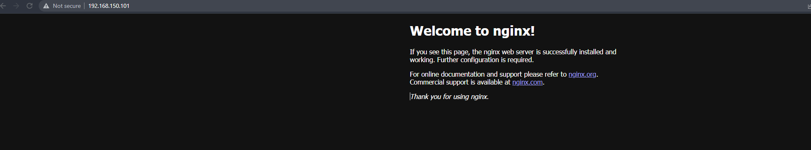

# Common steps

Both solutions relly on Vagrant and VirtualBox to spin up a VMs hence we must install them first.

I am using scoop package manager on Windows, so example code is:

```
scoop bucket add nonportable
scoop bucket add main

scoop install virtualbox-np
scoop install vagrant
```


# Steps Solution Task 1

1. Spin up the VM using vagran

```
pwd
## Path
## ----
## C:\Users\ivan\Documents\repos\DevOps-SoftUni-2022\02_Ansible\Solution_Task_01

vagrant up
vagrant ssh ansible
```

Once that is done, we will have two VM, we need to SSH into the first

2. Initialize and run Ansible

```
cd /vagrant

## Install all needed roles and collections
ANSIBLE_CONFIG=./ansible.cfg ansible-galaxy install -r requirements.yml --force

## RUN PLAYBOOK
ANSIBLE_CONFIG=./ansible.cfg ansible-playbook playbook.yml
```

We wait for the apply to complete, once it's done the output should look like:

```
PLAY RECAP ****************************************************************************************************************************
web                        : ok=19   changed=11   unreachable=0    failed=0    skipped=11   rescued=0    ignored=0
```

You could go to the of your web vm http://192.168.150.101/ (remember this is hardcoded in the Vagrantfile) and you would see the default nginx welcome screen.



### EASTER EGG INCLUDED, if you want to see it, you must change the playbook.yml file, specifically the variables `install_easter_egg`


# Steps Solution Task 2

